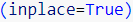

# challenge_4
This repository compares traditional investment strategies with algorithmic trading.

## References
* [Function .absolute()](https://www.programiz.com/python-programming/examples/current-working-directory)

* Asked professors about the `inplace` argument during code drill.

* [In-depth about Correlation Matrix](https://builtin.com/data-science/correlation-matrix)

* [Basic pandas concepts](https://saturncloud.io/blog/how-to-calculate-daily-returns-with-pandas-dataframe/)

* [Function .emw()](https://www.scaler.com/topics/pandas-ewm/)

* Supplemental files provided by university, class notes, self-study, youtube videos, googling, investopedia, geekforgeeks for better understanding of a varity of topics.
